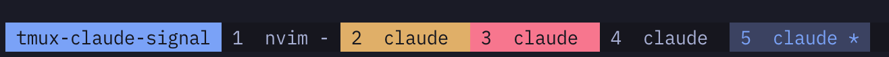

# tmux-claude-signal

Window-status color signal for Claude Code panes inside the current tmux session.

## Setup

Install via TPM by adding the line below to `~/.tmux.conf` and pressing `prefix + I`.

```tmux
set -g @plugin 'yasainet/tmux-claude-signal'
```

Then merge `hooks/claude-hooks.json` into `~/.claude/settings.json` so Claude Code reports state transitions.

Plugin source 時に過去スキーマと不在 window 由来の env を自動掃除します。

## Usage

Each Claude Code pane raises one of two attention signals.

| state       | Claude Code hook  | default visual | cleared by          |
| ----------- | ----------------- | -------------- | ------------------- |
| running     | PreToolUse        | スピナー (opt-in) | 次の状態          |
| needs-input | PermissionRequest | 💛 yellow      | focus or next state |
| done        | Stop              | ❤️ red         | focus or next state |

### Sample



Both signals clear as soon as you focus the window.
Resuming work (UserPromptSubmit / PreToolUse) also clears any stale signal.

Override colors with these options.

```tmux
set -g @claude-signal-needs-input-bg 'yellow'
set -g @claude-signal-needs-input-fg 'black'
set -g @claude-signal-done-bg 'red'
set -g @claude-signal-done-fg 'black'
```

Optionally add a spinner to show while Claude Code is executing tools.

```tmux
set -g @claude-signal-running-frames "⠋ ⠙ ⠹ ⠸ ⠼ ⠴ ⠦ ⠧ ⠇ ⠏"
```
